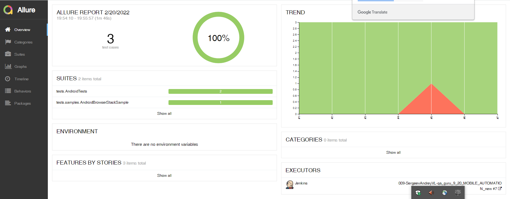
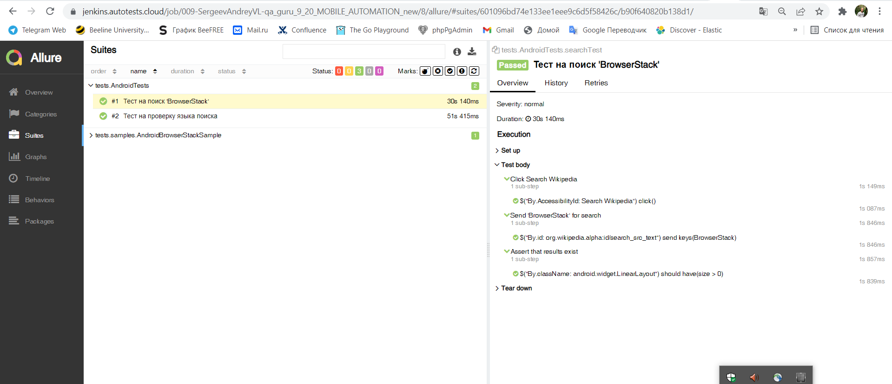
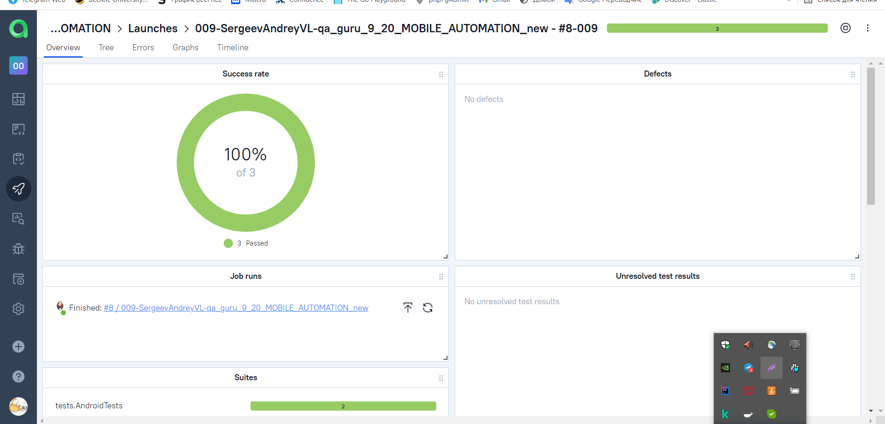
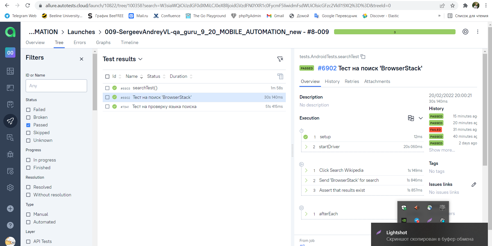
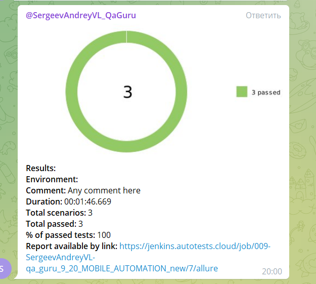

##   Примеры UI автотестов для Android приложения Wikipedia


##  Запуск проекта:

Локально для запуска всех тестов:
```bash
gradle clean test
```


- для удаленного запуска воспользуйтесь [Jenkins](https://jenkins.autotests.cloud/job/009-ioomoon-unit20/):

> Вы можете запускать тесты, настроив следующие параметры:
>> * ENVIRONMENT (default PROD)


##  Отчеты в Allure Report



##  Интеграция тестов c тест-менеджмент системой Allure TestOps




##  Telegram-уведомления о прохождении тестов
